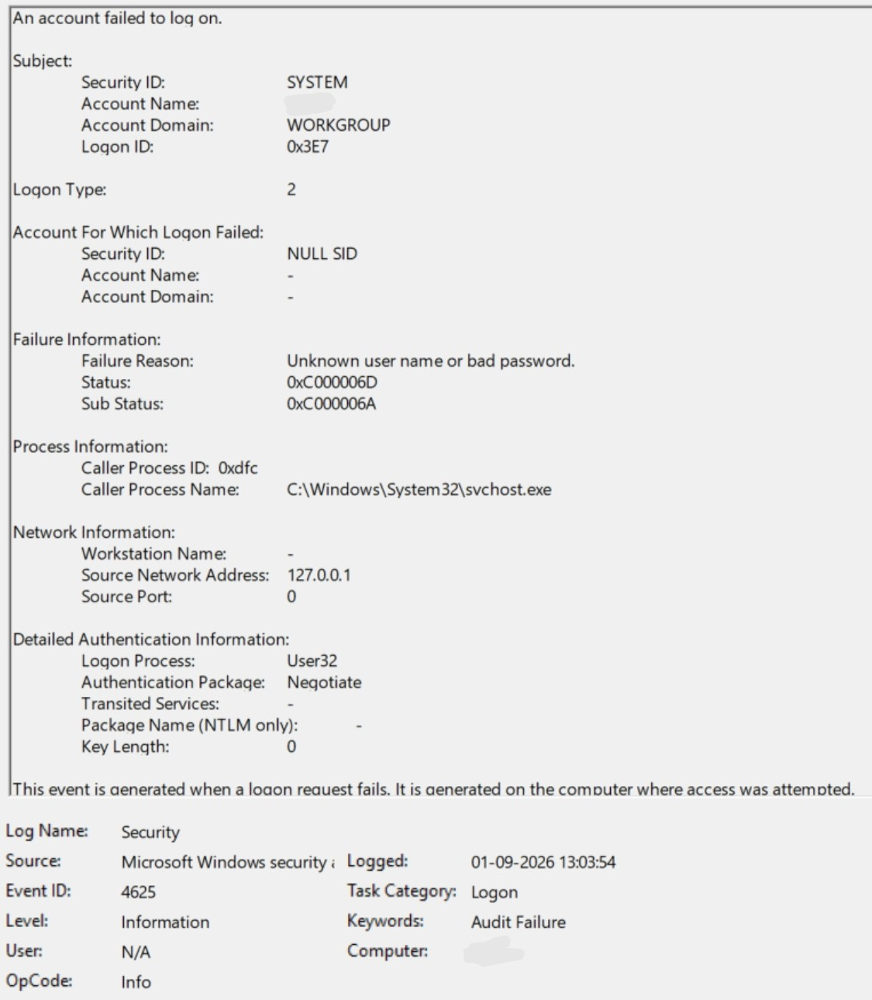
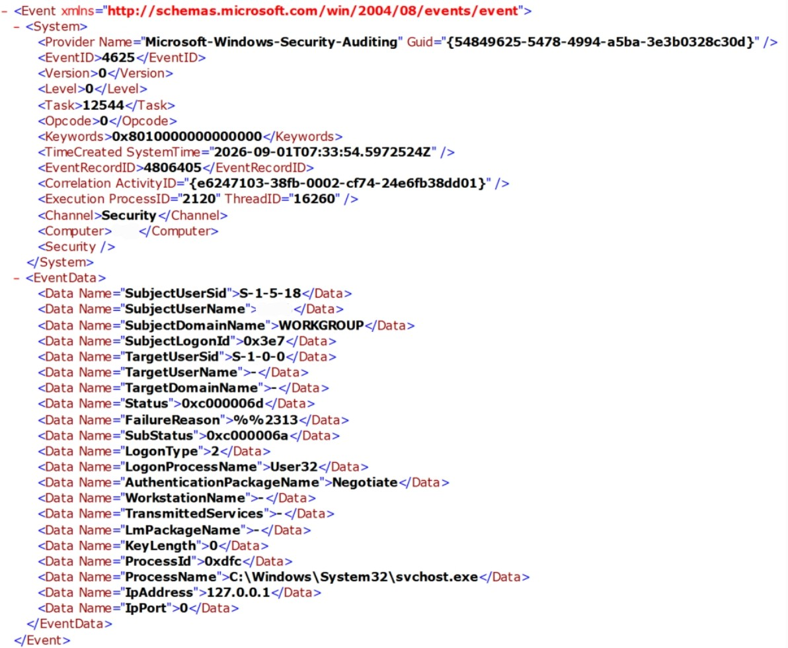
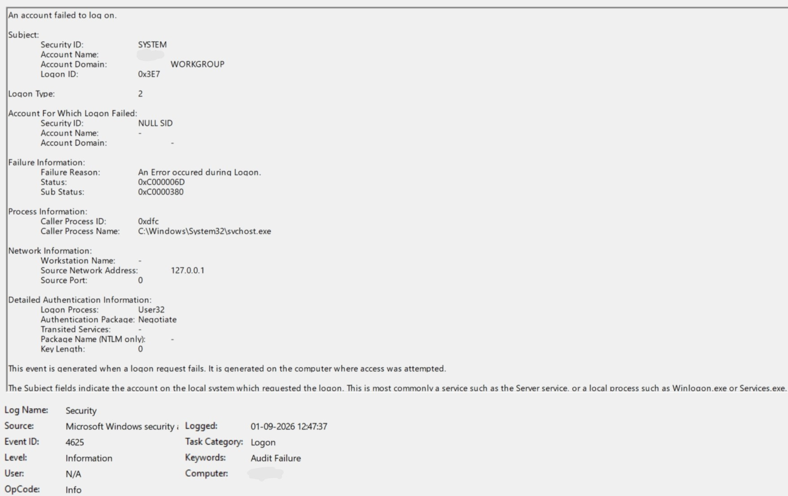
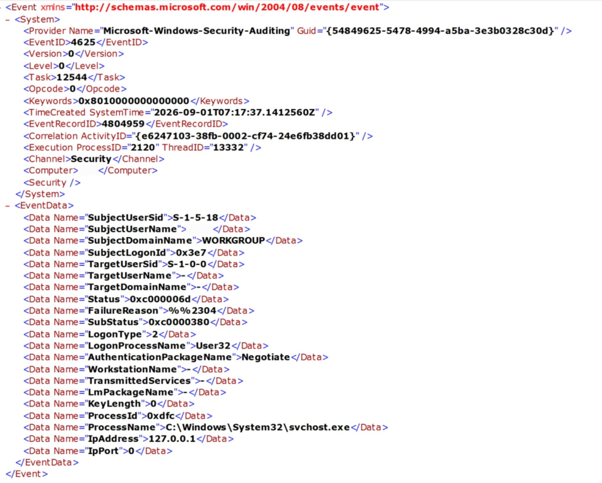

# Windows Authentication Failure Analysis

## Objective

The objective of this lab was to practice security incident triage by examining controlled Windows authentication failures and analyzing the resulting Windows Security Event ID 4625 records.

The investigation focused on understanding how authentication evidence can be validated using timestamps, logon type, failure information, authentication fields, and raw XML event data.

## Lab Environment

- Operating system: Windows
- Test environment: Local Windows workstation
- Account type used during testing: Local account
- Log source: Windows Security Event Log
- Primary event investigated: Event ID `4625` — failed logon
- Logon type observed: `2` — interactive logon

> Note: The captured 4625 events did not populate `TargetUserName`; the field appeared as `-`. The account visible in the Subject section represents the system context that requested the logon and should not be confused with the target account.

## Investigation Method

The investigation followed:

**Goal → Question → Action → Evidence → Analysis → Conclusion**

Two authentication-failure scenarios were examined:

1. Incorrect password
2. Incorrect Windows Hello PIN

---

## Test 1 — Incorrect Password

### Action

A controlled incorrect-password authentication attempt was performed.

Windows rejected the authentication attempt.

A corresponding Windows Security Event ID `4625` was examined.

### Evidence Observed

- Event ID: `4625`
- Logged time: `01-09-2026 13:03:54`
- Target username recorded by event: `-`
- Failure Reason: `Unknown user name or bad password`
- Status: `0xC000006D`
- Sub Status: `0xC000006A`
- Logon Type: `2`
- Caller Process: `C:\Windows\System32\svchost.exe`
- Logon Process: `User32`
- Authentication Package: `Negotiate`
- Workstation Name: `-`
- Source Network Address: `127.0.0.1`

### General Event View

### Raw XML View

The raw XML confirmed the structured values shown in Event Viewer, including:

- `Status = 0xc000006d`
- `SubStatus = 0xc000006a`
- `LogonType = 2`
- `LogonProcessName = User32`
- `AuthenticationPackageName = Negotiate`
- `IpAddress = 127.0.0.1`

The XML timestamp is stored in UTC, while Event Viewer displays the corresponding local time.

---

## Test 2 — Incorrect Windows Hello PIN

### Action

A controlled incorrect Windows Hello PIN authentication attempt was performed.

Windows rejected the authentication attempt.

A corresponding Windows Security Event ID `4625` was examined.

### Evidence Observed

- Event ID: `4625`
- Logged time: `01-09-2026 12:47:37`
- Target username recorded by event: `-`
- Failure Reason: `An Error occurred during Logon`
- Status: `0xC000006D`
- Sub Status: `0xC0000380`
- Logon Type: `2`
- Caller Process: `C:\Windows\System32\svchost.exe`
- Logon Process: `User32`
- Authentication Package: `Negotiate`
- Workstation Name: `-`
- Source Network Address: `127.0.0.1`

### General Event View

### Raw XML View

The raw XML confirmed:

- `Status = 0xc000006d`
- `SubStatus = 0xc0000380`
- `LogonType = 2`
- `LogonProcessName = User32`
- `AuthenticationPackageName = Negotiate`
- `IpAddress = 127.0.0.1`

---

## Comparison

| Field | Incorrect Password | Incorrect PIN |
| --- | --- | --- |
| Event ID | 4625 | 4625 |
| Target username in event | `-` | `-` |
| Logon Type | 2 | 2 |
| Status | `0xC000006D` | `0xC000006D` |
| Sub Status | `0xC000006A` | `0xC0000380` |
| Failure Reason | Unknown user name or bad password | An Error occurred during Logon |
| Logon Process | User32 | User32 |
| Authentication Package | Negotiate | Negotiate |
| Source Address | 127.0.0.1 | 127.0.0.1 |

## Analysis

Both authentication failures generated Windows Security Event ID `4625` with Logon Type `2`, indicating interactive authentication attempts.

The incorrect-password event produced:

`Sub Status: 0xC000006A`

The incorrect-PIN event produced:

`Sub Status: 0xC0000380`

The password event's human-readable failure reason was:

`Unknown user name or bad password`

The PIN event instead displayed:

`An Error occurred during Logon`

The raw XML views were examined to confirm that these values were present in the underlying structured event data and were not transcription errors.

Another important observation was that `TargetUserName` was not populated in either captured event. Therefore, the Subject account shown elsewhere in the event should not be incorrectly documented as the failed target account.

The source address was `127.0.0.1`, which represents the local host and does not indicate authentication originating from an external system.

## Triage Lessons Learned

This lab demonstrated that:

- Event ID alone is not enough to understand authentication activity.
- Logon Type provides important context about how authentication occurred.
- The Subject account and target account are different fields.
- Missing event fields should be documented as missing rather than replaced with assumed values.
- Failure Reason, Status, and Sub Status should be analyzed together.
- Raw XML can validate Event Viewer's human-readable representation.
- Timestamps are important when correlating known actions with security events.
- `127.0.0.1` represents localhost and does not identify an external attacker.
- A failed authentication event does not automatically indicate malicious activity.
- Evidence should be documented before forming conclusions.

## Conclusion

I examined controlled Windows password and Windows Hello PIN authentication failures using Windows Security Event ID 4625.

The lab demonstrated practical authentication-event analysis, interpretation of failure information, comparison of authentication contexts, validation using raw XML, and careful separation of observed evidence from assumptions.

These authentication failures were deliberately generated in a controlled lab environment and do not represent a real security incident.

## Current Limitations

This lab analyzed individual authentication-failure events.

It did not yet correlate multiple failed attempts with a subsequent successful authentication or determine whether a larger sequence represented suspicious activity.

That correlation will be investigated in future triage work.

## References

- Microsoft Learn — Event ID 4625: An account failed to log on
- Microsoft documentation for Windows NTSTATUS values