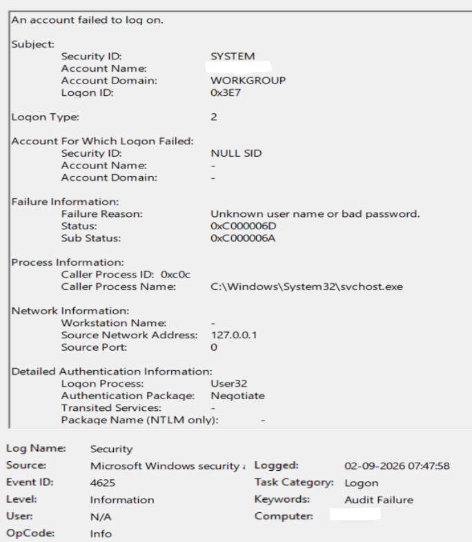
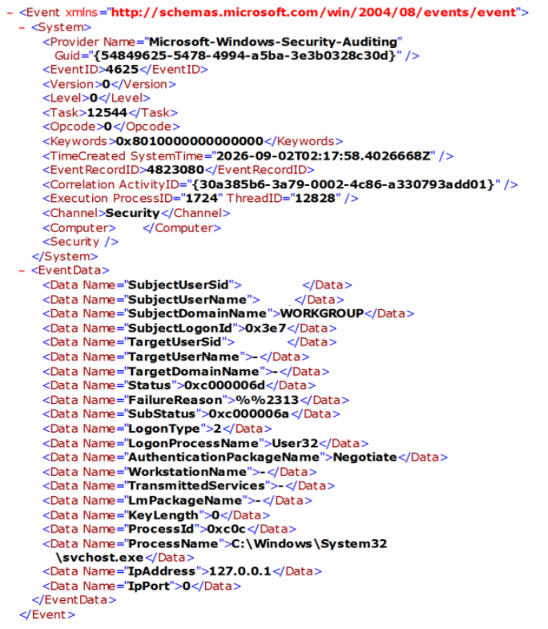
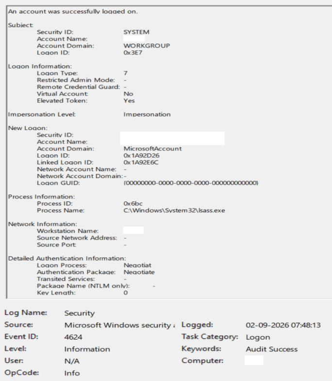
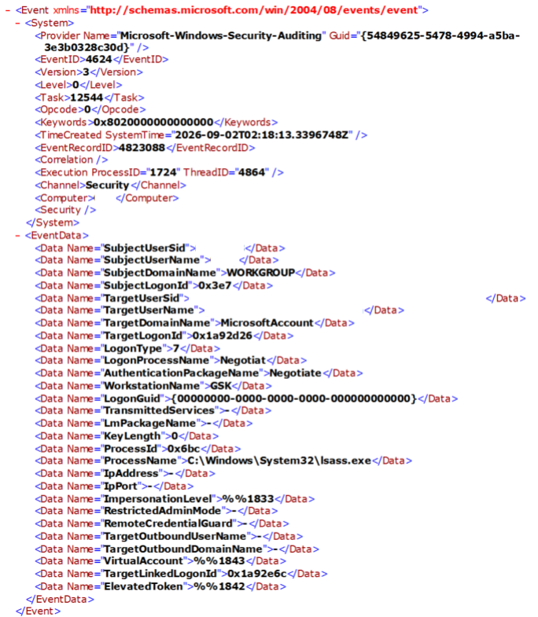
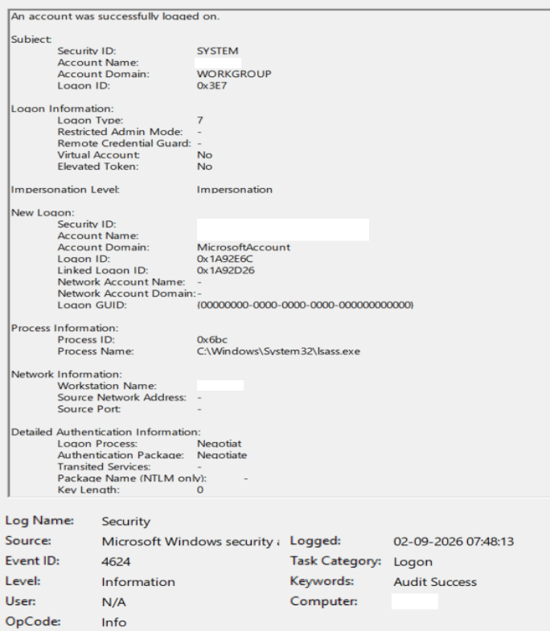
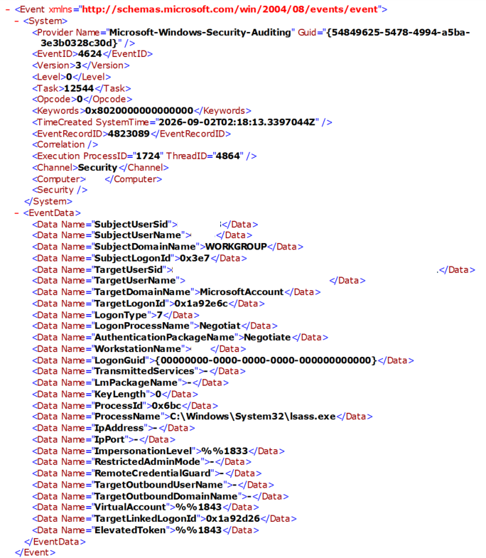

# Windows Authentication Timeline Correlation

## Objective

The objective of this lab was to practice security incident triage by correlating a controlled failed Windows authentication attempt with subsequent successful authentication activity.

The investigation focused on moving beyond analysis of a single event and building a defensible authentication timeline using Windows Security Event IDs `4625` and `4624`.

---

## Lab Environment

- Operating system: Windows
- Test environment: Local Windows workstation
- Log source: Windows Security Event Log
- Failed authentication event: Event ID `4625`
- Successful authentication event: Event ID `4624`
- Test action: Lock workstation, perform one incorrect password attempt, then authenticate successfully

This was a controlled lab activity and does not represent a real security incident.

---

## Investigation Question

**Did a successful authentication occur shortly after the controlled failed password attempt, and what Windows log evidence supports that conclusion?**

The investigation followed:

**Goal → Question → Action → Evidence → Analysis → Conclusion**

---

## Controlled Test

The workstation was locked using:

`Windows key + L`

One intentionally incorrect password was entered and rejected.

A correct password was then entered and the workstation was successfully unlocked.

No additional failed-password attempts were intentionally generated during the test window.

---

## Failed Authentication Evidence

A matching Windows Security Event ID `4625` was identified.

### Observed Fields

- Logged time: `02-09-2026 07:47:58`
- Event ID: `4625`
- Result: Failed authentication
- Failure Reason: `Unknown user name or bad password`
- Status: `0xC000006D`
- Sub Status: `0xC000006A`
- Logon Type: `2`
- Target username: `-`
- Caller Process: `C:\Windows\System32\svchost.exe`
- Logon Process: `User32`
- Authentication Package: `Negotiate`
- Workstation Name: `-`
- Source Network Address: `127.0.0.1`

The source address `127.0.0.1` represents localhost.

The event did not populate the target username, so no username was inferred from other fields.

### General View

### XML View

The raw XML was used to confirm:

- `EventID = 4625`
- `LogonType = 2`
- `Status = 0xc000006d`
- `SubStatus = 0xc000006a`
- `LogonProcessName = User32`
- `AuthenticationPackageName = Negotiate`
- `IpAddress = 127.0.0.1`

---

## Successful Authentication Evidence

At `02-09-2026 07:48:13`, multiple Event ID `4624` records were observed.

The events included:

- two Logon Type `7` records
- two Logon Type `11` records

Because the controlled action involved unlocking an already-locked workstation, Logon Type `7` was treated as the primary evidence of the successful workstation unlock.

---

## Logon Type 7 — Workstation Unlock

Two Type `7` Event ID `4624` records occurred at:

`02-09-2026 07:48:13`

Both represented the same account context and were linked to each other through their Linked Logon IDs.

### Elevated Session

- Event ID: `4624`
- Logon Type: `7`
- Logon ID: `0x1A92D26`
- Linked Logon ID: `0x1A92E6C`
- Process ID: `0x6bc`
- Process Name: `C:\Windows\System32\lsass.exe`
- Elevated Token: `Yes`
- Virtual Account: `No`
- Source Network Address: `127.0.0.1`

### Non-Elevated Session

- Event ID: `4624`
- Logon Type: `7`
- Logon ID: `0x1A92E6C`
- Linked Logon ID: `0x1A92D26`
- Process ID: `0x6bc`
- Process Name: `C:\Windows\System32\lsass.exe`
- Elevated Token: `No`
- Virtual Account: `No`
- Source Network Address: `127.0.0.1`

### Linked Session Observation

The two Type `7` events directly referenced each other:

| Session | Logon ID | Linked Logon ID | Elevated Token |
|---|---|---|---|
| Type 7 session 1 | `0x1A92D26` | `0x1A92E6C` | Yes |
| Type 7 session 2 | `0x1A92E6C` | `0x1A92D26` | No |

This supports the conclusion that the two records represent paired authentication contexts rather than two unrelated workstation unlocks.

---

## Supporting Logon Type 11 Activity

Two additional Event ID `4624` records with Logon Type `11` occurred at the same time:

`02-09-2026 07:48:13`

The observed pair was:

| Logon ID | Linked Logon ID | Elevated Token |
|---|---|---|
| `0x1A92633` | `0x1A92670` | Yes |
| `0x1A92670` | `0x1A92633` | No |

Additional observations:

- Logon Type: `11`
- Process ID: `0xc0c`
- Process Name: `C:\Windows\System32\svchost.exe`
- Logon Process: `User32`
- Authentication Package: `Negotiate`
- Source Network Address: `127.0.0.1`

Logon Type `11` represents CachedInteractive authentication.

These events were recorded as supporting authentication activity in the same time window.

They were not used as the primary evidence of the workstation unlock because Logon Type `7` directly represents an unlock operation.

The Type `11` pair and Type `7` pair were internally linked within their respective pairs, but no Linked Logon ID was observed connecting the Type `11` pair directly to the Type `7` pair.

---

## Authentication Timeline

| Time | Event ID | Logon Type | Result | Interpretation |
|---|---:|---:|---|---|
| 07:47:58 | 4625 | 2 | Failed | Controlled incorrect password |
| 07:48:13 | 4624 | 7 | Successful | Workstation unlock |
| 07:48:13 | 4624 | 11 | Successful | Supporting CachedInteractive activity |

### Time Difference

The successful authentication activity occurred:

`07:48:13 - 07:47:58 = 15 seconds`

after the failed authentication event.

---

## Correlation Analysis

The failed Event ID `4625` occurred during the known controlled password-failure test.

Fifteen seconds later, Windows recorded successful Event ID `4624` authentication activity.

The strongest evidence connecting the successful events to the test is:

- known controlled test action
- close timestamp relationship
- failed authentication followed by successful authentication
- Logon Type `7` matching the workstation-unlock action
- localhost source address
- paired Type `7` logon sessions
- supporting Type `11` authentication records in the same time window

The failed `4625` event did not contain a populated target username. Therefore, the correlation was not based on matching usernames.

Instead, it was based on the controlled action, timestamps, authentication context, and surrounding Windows Security events.

---

## Conclusion

The controlled failed password authentication at `07:47:58` was followed approximately **15 seconds later** by successful workstation-unlock activity recorded as Event ID `4624` Logon Type `7`, with supporting Logon Type `11` CachedInteractive events.

The evidence supports a failed-then-successful authentication sequence associated with the controlled lab test.

There is no evidence from this test alone that indicates malicious activity, account compromise, or a security incident.

---

## Triage Decision

### Severity

**Informational**

The observed sequence was deliberately generated during a controlled authentication test.

A single failed authentication at `07:47:58` was followed 15 seconds later by successful workstation-unlock activity. No demonstrated security impact or malicious follow-on activity was identified in the evidence examined.

### Disposition

**Benign / Test Activity**

The authentication sequence directly matches the known controlled actions performed during the lab.

Supporting evidence includes:

- the failed authentication was deliberately generated
- the recorded source address was localhost (`127.0.0.1`)
- successful workstation-unlock activity followed 15 seconds later
- no malicious follow-on activity was identified
- no contradictory evidence was identified

**Confidence: High**

### Escalation Decision

**Do Not Escalate**

The activity is confidently explained as authorized controlled testing. No unresolved security questions or evidence requiring higher-tier investigation were identified.

### Closure Recommendation

**Close — Authorized Test Activity**

No additional investigation is required for this controlled lab sequence.

---

## Evidence Handling

Before being added to the public portfolio, screenshots were sanitized to remove identifying information such as:

- account email address
- personal username
- hostname or machine account
- account-specific SID

Technical evidence required for the analysis was retained.

Unredacted originals were kept outside the Git repository.

---

## Investigation Limitation

An initial manually recorded time of `23:48` did not match the subsequently confirmed test time or the Windows Security event timestamps.

The controlled test was later confirmed to have occurred around `07:48` on `02-09-2026`.

Because the original manual note was inconsistent with validated system evidence, it was not used as the authoritative timestamp for the analysis.

This demonstrates the importance of validating analyst notes against primary log evidence.

---

## Skills Practiced

- Windows authentication-event analysis
- Event ID `4625` interpretation
- Event ID `4624` interpretation
- failed-to-successful authentication correlation
- authentication timeline construction
- Logon Type analysis
- Linked Logon ID analysis
- elevated versus non-elevated session comparison
- raw XML validation
- evidence-based conclusions
- handling conflicting analyst notes
- evidence sanitization