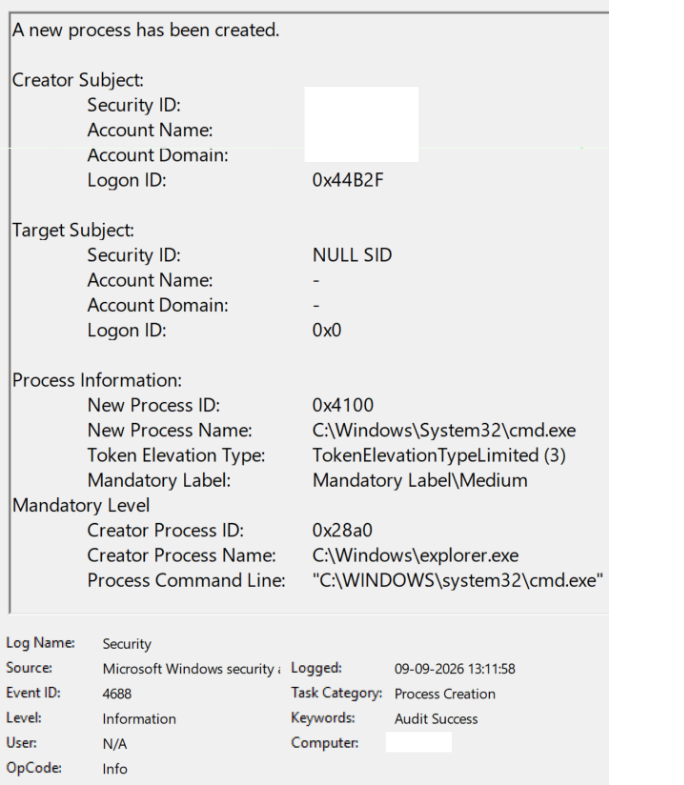
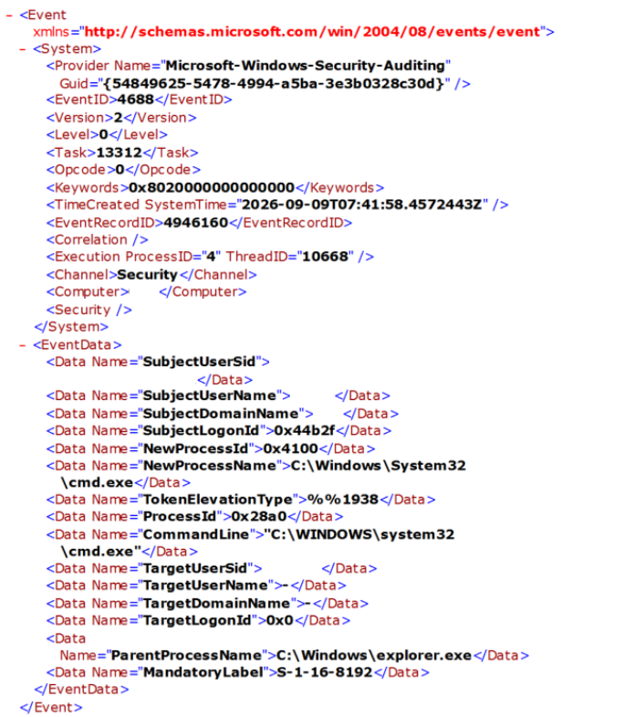
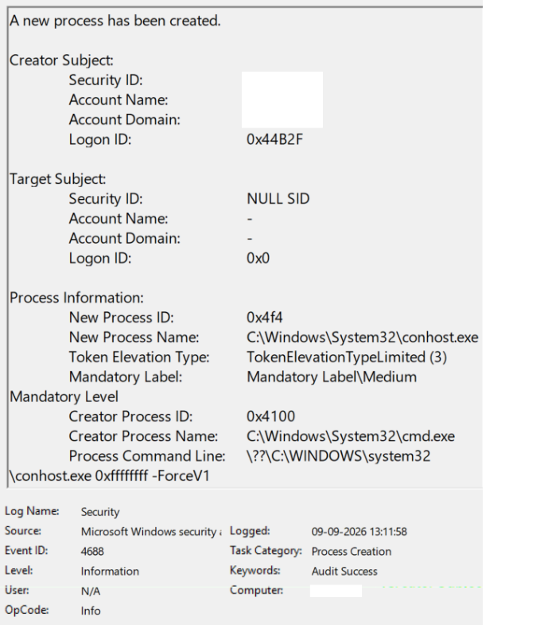
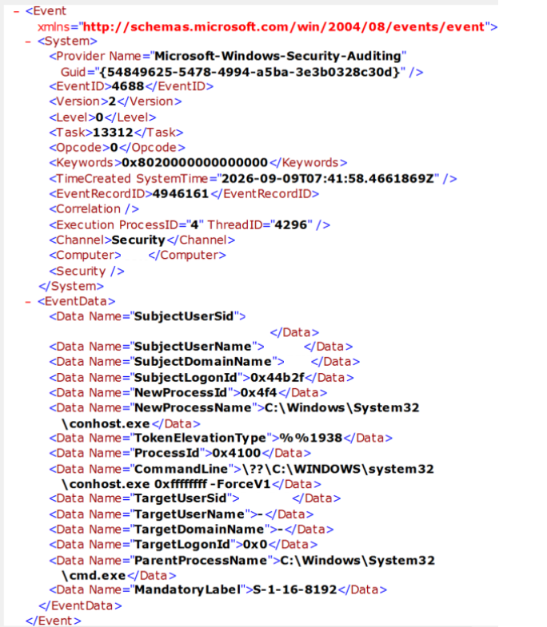
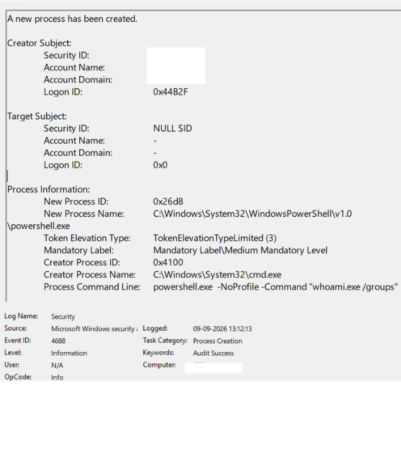
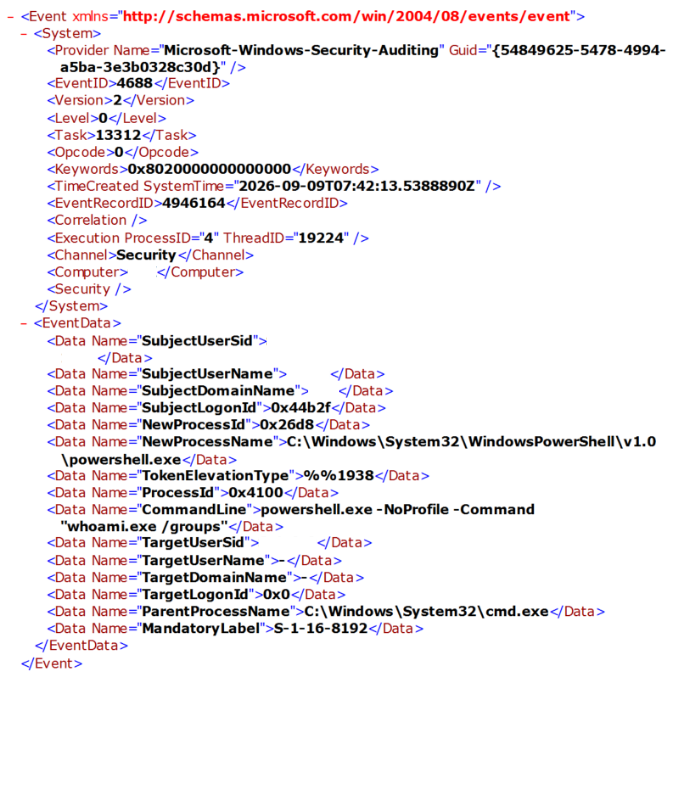
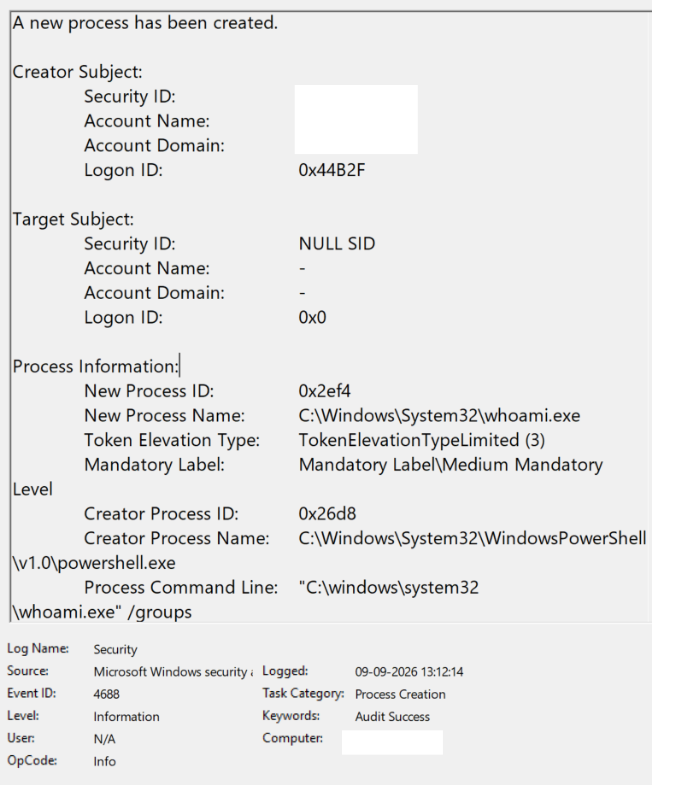
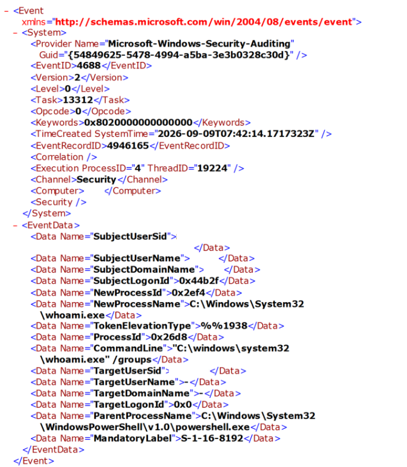

# Windows PowerShell Discovery Triage

## Lab Status

**Documentation complete locally — QA and GitHub publication pending**

The controlled investigation, evidence collection, analysis, screenshot sanitization, and local documentation are complete.

Final repository QA, commit/push, and remote GitHub verification are still pending.

## Objective

Investigate a controlled Windows process sequence involving PowerShell and `whoami.exe /groups`, correlate Event ID `4688` process-creation telemetry, and determine whether the observed discovery behavior should be escalated or closed as authorized activity.

## Investigation Scenario

A PowerShell process executed `whoami.exe /groups`.

Because both PowerShell and WHOAMI are legitimate Windows tools that can also appear during adversary discovery activity, the process names alone are insufficient for a reliable SOC disposition.

The investigation therefore focuses on:

- process lineage
- process IDs
- timestamps
- executable paths
- command-line arguments
- token elevation context
- surrounding process activity
- authorization context

## Data Source

- Windows Security event log
- Event ID `4688` — A new process has been created

## Current Learning Focus

- dual-use process assessment
- PowerShell triage
- discovery-command analysis
- parent-child process correlation
- evidence-based severity and disposition
- separating observed behavior from authorization context

## Evidence Collection

## Evidence Collection

The investigation used Windows Security Event ID `4688` process-creation telemetry.

All preserved screenshots were sanitized before inclusion in the public portfolio. Personal identifiers such as usernames, SIDs, hostnames, email addresses, and other identifying values were redacted while investigation-relevant fields were retained.

### Process Timeline

| Time | Process | New Process ID | Creator Process | Creator Process ID | Command Line |
|---|---|---:|---|---:|---|
| 09-09-2026 13:11:58 | `cmd.exe` | `0x4100` | `explorer.exe` | `0x28a0` | `"C:\WINDOWS\system32\cmd.exe"` |
| 09-09-2026 13:11:58 | `conhost.exe` | `0x4f4` | `cmd.exe` | `0x4100` | `\??\C:\WINDOWS\system32\conhost.exe 0xffffffff -ForceV1` |
| 09-09-2026 13:12:13 | `powershell.exe` | `0x26d8` | `cmd.exe` | `0x4100` | `powershell.exe -NoProfile -Command "whoami.exe /groups"` |
| 09-09-2026 13:12:14 | `whoami.exe` | `0x2ef4` | `powershell.exe` | `0x26d8` | `"C:\windows\system32\whoami.exe" /groups` |

The correlated events used Subject Logon ID `0x44B2F`.

The observed processes ran with `TokenElevationTypeLimited (3)`. In raw Event ID `4688` XML, this token-elevation value may appear as `%%1938`.

### Evidence-Backed Process Lineage

```text
explorer.exe
PID 0x28a0
    |
    v
cmd.exe
PID 0x4100
    |\
    | \
    |  --> conhost.exe
    |       PID 0x4f4
    |
    v
powershell.exe
PID 0x26d8
    |
    v
whoami.exe
PID 0x2ef4
```

The strongest parent-child correlations were:

- `cmd.exe` New Process ID `0x4100` matched the PowerShell event's Creator Process ID `0x4100`.
- PowerShell New Process ID `0x26d8` matched the WHOAMI event's Creator Process ID `0x26d8`.
- `conhost.exe` identified `cmd.exe` PID `0x4100` as its creator.
- The observed events shared Subject Logon ID `0x44B2F`.

### Evidence Files

The following sanitized screenshots preserve the relevant Event ID `4688` evidence used during the investigation.

#### CMD — General View



#### CMD — XML View



#### Console Host — General View



#### Console Host — XML View



#### PowerShell — General View



#### PowerShell — XML View



#### WHOAMI — General View



#### WHOAMI — XML View




## Analysis

### Why the Activity Required Triage

PowerShell and WHOAMI are legitimate Windows utilities, but both can also appear during adversary activity.

The command:

`powershell.exe -NoProfile -Command "whoami.exe /groups"`

caused PowerShell to launch `whoami.exe /groups`.

The `/groups` option enumerates group memberships, group SIDs, and associated group attributes for the current security context.

The behavior therefore has legitimate administrative uses while also being compatible with discovery activity.

### Potentially Suspicious Indicators

- PowerShell was used as an execution mechanism.
- PowerShell launched a system-discovery utility.
- `whoami.exe /groups` can reveal information useful for understanding account group membership and access context.
- `-NoProfile` can appear in scripted or automated execution, although it is also common in legitimate administration and is weak evidence by itself.

### Benign Indicators

- Executables ran from standard Windows system paths.
- The command lines were clear and unobfuscated.
- No `-EncodedCommand` argument was observed.
- No explicit execution-policy bypass was observed.
- The process lineage was consistent with an Explorer-launched Command Prompt session.
- `conhost.exe` appeared with the Command Prompt startup and used the standard System32 path.
- No additional suspicious process creations were observed in the examined 35-second Event ID `4688` window.

### Token Context

`TokenElevationTypeLimited (3)` provided useful execution context but did not determine the disposition.

A limited token does not prove that activity is benign, and it does not by itself establish the underlying account's administrative membership.

### Evidence-Only Assessment

Before authorization context was introduced, the activity was assessed as:

- **Severity:** Low
- **Disposition:** Needs More Investigation
- **Confidence:** Medium
- **Escalation:** No immediate escalation; continue contextual verification

The process telemetry showed behavior compatible with legitimate interactive use, but process evidence alone could not establish user intent or authorization.

### Authorization Context

The activity was subsequently confirmed as intentionally generated during a controlled and authorized cybersecurity lab.

This out-of-band context resolved the primary remaining uncertainty: why the discovery command was executed.

## Investigation Limitations

- The surrounding-activity review covered a 35-second Event ID `4688` process-creation window.
- Network activity was not assessed as part of that process-only window.
- Standard executable paths were observed, but file hashes and digital signatures were not independently validated.
- Process lineage and command-line telemetry can describe execution behavior but cannot independently prove user intent or authorization.
- Authorization was established through known controlled-lab context rather than process telemetry alone.

## Final SOC Decision

- **Severity:** Informational
- **Disposition:** Benign — Authorized Activity
- **Confidence:** High
- **Escalation:** Do Not Escalate
- **Closure:** Close — Authorized Test Activity

The activity was closed as benign because the process evidence was consistent with controlled interactive execution and the remaining authorization question was resolved through confirmed lab context.

The final decision did not rely on process names alone. It combined process lineage, PIDs, timestamps, executable paths, command-line arguments, token context, surrounding Event ID `4688` activity, and authorization context.

## Key SOC Lessons

- Dual-use utilities must be evaluated using context rather than process names alone.
- Parent-child PID correlation provides stronger evidence than process-name correlation by itself.
- Standard executable paths are useful indicators but do not prove binary integrity.
- `TokenElevationTypeLimited (3)` is context, not a benign or malicious verdict.
- A short process window can establish surrounding execution activity but cannot substitute for network, EDR, or other telemetry.
- Evidence can show what happened without proving why it happened.
- A benign-looking process chain should not be closed as authorized until authorization or user intent is established.
- Severity, disposition, confidence, escalation, and closure are separate SOC decisions.