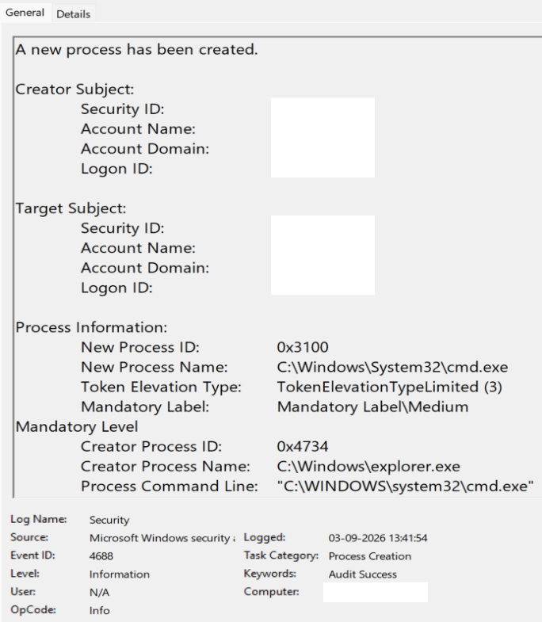
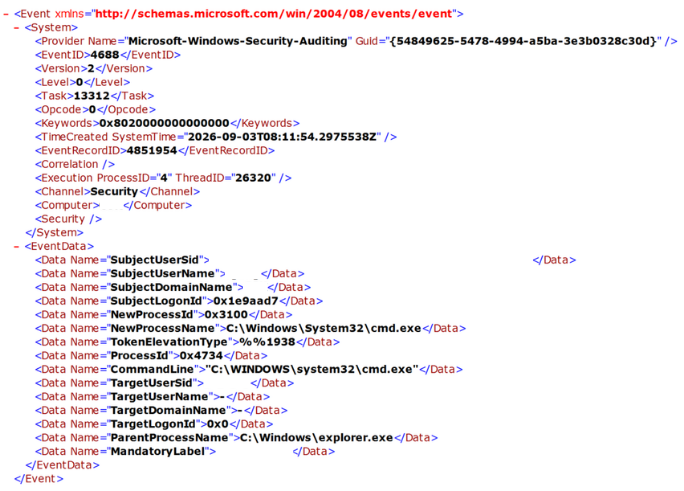
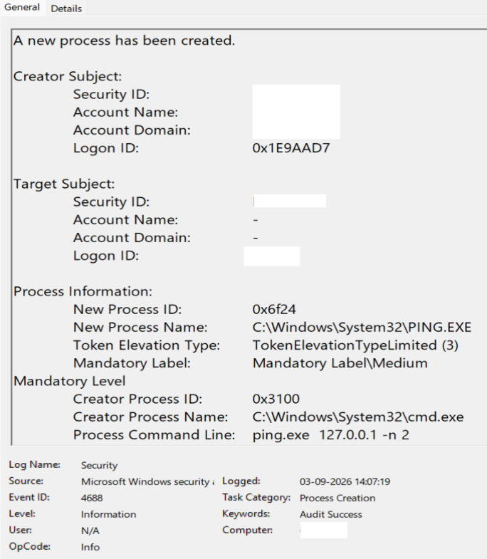
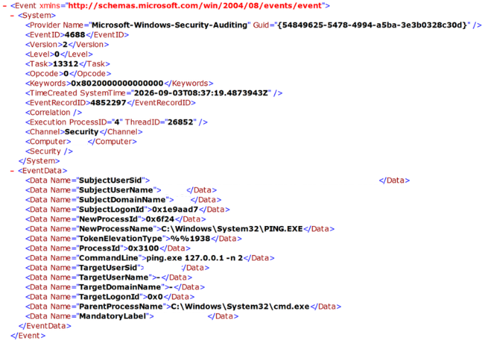

# Windows Process Parent-Child Correlation

## Objective

The objective of this lab was to investigate Windows process-creation activity using Windows Security Event ID `4688` and reconstruct a process tree using primary log evidence.

The investigation focused on:

- identifying newly created processes
- identifying parent processes
- correlating processes using process IDs
- examining executable paths
- examining command-line arguments
- interpreting token elevation context
- distinguishing expected activity from potentially suspicious activity
- documenting evidence suitable for a cybersecurity portfolio

The controlled process chain investigated in this lab was:

```text
explorer.exe
    ↓
cmd.exe
    ↓
PING.EXE
```

---

## Lab Environment

The lab was performed on a Windows workstation using:

- Windows Event Viewer
- Windows Security log
- Windows Security Event ID `4688`
- Windows process-creation auditing
- process command-line auditing
- Command Prompt
- `ping.exe`
- PowerShell for targeted event searching

This was an authorized and controlled local lab.

---

## Investigation Question

Can Windows Security Event ID `4688` be used to reconstruct a known parent-child process chain and determine whether the observed activity is expected or suspicious?

To answer this question, the investigation examined:

1. What process was created?
2. Which process created it?
3. What process IDs connect the events?
4. What executable paths were used?
5. What command lines were recorded?
6. What token context was present?
7. Does the process relationship match the known user activity?
8. Are there indicators that make the activity suspicious?

---

## Process-Creation Auditing

Before generating the controlled process activity, the Windows audit configuration was checked with:

```cmd
auditpol /get /subcategory:"Process Creation"
```

The initial result was:

```text
Process Creation    No Auditing
```

Process-creation auditing was then enabled:

```cmd
auditpol /set /subcategory:"Process Creation" /success:enable
```

Verification showed:

```text
Process Creation    Success
```

This configuration allowed successful process-creation activity to be recorded in the Windows Security log as Event ID `4688`.

---

## Command-Line Auditing

Initial `4688` testing showed that process events were being generated but the `CommandLine` field was blank.

The command-line inclusion setting was checked with:

```cmd
reg query "HKLM\Software\Microsoft\Windows\CurrentVersion\Policies\System\Audit" /v ProcessCreationIncludeCmdLine_Enabled
```

The registry value was initially not present.

Command-line inclusion was enabled with:

```cmd
reg add "HKLM\Software\Microsoft\Windows\CurrentVersion\Policies\System\Audit" /v ProcessCreationIncludeCmdLine_Enabled /t REG_DWORD /d 1 /f
```

Verification showed:

```text
ProcessCreationIncludeCmdLine_Enabled    REG_DWORD    0x1
```

New Event ID `4688` records generated after this configuration included process command-line information.

### Security Consideration

Command-line auditing improves investigation visibility but command lines can sometimes contain sensitive information, including:

- credentials
- tokens
- API keys
- personal file paths
- usernames
- URLs containing sensitive parameters

For this reason, command-line evidence must be reviewed before being published.

---

## Initial Process-Creation Validation

A controlled command was executed from a normal Command Prompt:

```cmd
ping.exe 127.0.0.1 -n 4
```

Windows generated an Event ID `4688` containing:

```text
New Process Name:   C:\Windows\System32\PING.EXE
Parent Process Name: C:\Windows\System32\cmd.exe
Command Line:       ping.exe 127.0.0.1 -n 4
```

This confirmed that both process-creation auditing and command-line recording were functioning.

The loopback address `127.0.0.1` represents the local machine. Therefore, this command sent ICMP echo requests to the local TCP/IP stack rather than to another network host.

---

## Controlled Parent-Child Test

For the main correlation exercise, all previously used normal Command Prompt windows were closed.

A fresh non-administrative Command Prompt was then launched through:

```text
Windows + R
→ cmd
→ Enter
```

The Command Prompt was deliberately left open.

From that same Command Prompt, the following command was later executed:

```cmd
ping.exe 127.0.0.1 -n 2
```

This created a known process sequence that could be compared against Windows Security log evidence.

Expected process chain:

```text
explorer.exe
    ↓
cmd.exe
    ↓
PING.EXE
```

---

## Parent Process Evidence — cmd.exe

Windows recorded the creation of the fresh Command Prompt as Event ID `4688`.

### Timestamp

```text
03-09-2026 13:41:54
```

### Observed Fields

```text
New Process ID:       0x3100
New Process Name:     C:\Windows\System32\cmd.exe

Creator Process ID:   0x4734
Creator Process Name: C:\Windows\explorer.exe

Process Command Line:
"C:\WINDOWS\system32\cmd.exe"

Token Elevation Type:
TokenElevationTypeLimited (3)
```

The evidence supports the following relationship:

```text
C:\Windows\explorer.exe
PID 0x4734
        ↓
C:\Windows\System32\cmd.exe
PID 0x3100
```

This relationship is consistent with the known interactive action of launching Command Prompt through the Windows shell.

### General View Evidence



### XML Evidence



---

## Child Process Evidence — PING.EXE

The same Command Prompt with PID `0x3100` was then used to execute:

```cmd
ping.exe 127.0.0.1 -n 2
```

Windows recorded another Event ID `4688`.

### Timestamp

```text
03-09-2026 14:07:19
```

### Observed Fields

```text
New Process ID:       0x6f24
New Process Name:     C:\Windows\System32\PING.EXE

Creator Process ID:   0x3100
Creator Process Name: C:\Windows\System32\cmd.exe

Process Command Line:
ping.exe 127.0.0.1 -n 2

Token Elevation Type:
TokenElevationTypeLimited (3)
```

This evidence supports the relationship:

```text
C:\Windows\System32\cmd.exe
PID 0x3100
        ↓
C:\Windows\System32\PING.EXE
PID 0x6f24
```

### General View Evidence



### XML Evidence



---

## PID Correlation

The most important correlation occurred between the `cmd.exe` creation event and the later `PING.EXE` event.

The `cmd.exe` event recorded:

```text
NewProcessId = 0x3100
NewProcessName = C:\Windows\System32\cmd.exe
```
This field identifies the newly created Command Prompt process itself.

The `PING.EXE` event later recorded:

```text
Creator Process ID = 0x3100
Creator Process Name = C:\Windows\System32\cmd.exe
```
This field identifies the process that created `PING.EXE`.

The correlation can be represented as:

```text
cmd.exe NewProcessId
        0x3100
           │
           │ matches
           ▼
PING.EXE Creator Process ID
        0x3100
```

This matching PID, combined with the executable paths, timestamps, command-line evidence, and known controlled activity, supports the conclusion that the captured `cmd.exe` process created the observed `PING.EXE` process.

---

## Reconstructed Process Tree

Using both Event ID `4688` records, the process tree was reconstructed as:

```text
C:\Windows\explorer.exe
PID 0x4734
        ↓
C:\Windows\System32\cmd.exe
PID 0x3100
        ↓
C:\Windows\System32\PING.EXE
PID 0x6f24
```

This demonstrates how separate process-creation events can be correlated to reconstruct execution relationships.

---

## Why Process IDs Matter

Matching only process names is weaker than correlating process IDs. Multiple processes can share the same executable name, and attackers may use names resembling legitimate Windows processes.

In this investigation:

```text
cmd.exe NewProcessId = 0x3100
```

matched:

```text
PING.EXE Creator Process ID = 0x3100
```

This provides stronger evidence that the captured `cmd.exe` instance created the captured `PING.EXE` instance.


Process names alone are not strong enough to establish a specific parent-child relationship.

For example, a system can contain multiple instances of:

```text
cmd.exe
```

at different times or simultaneously.

An attacker could also potentially use misleading filenames that resemble legitimate processes.

Process IDs allow the analyst to associate a particular process instance with another process instance.

However, PIDs should not be treated as permanently unique identifiers.

Windows can reuse a PID after a process terminates.

Therefore, reliable process correlation should combine:

- process ID
- timestamp
- executable path
- parent process
- command line
- user/session context
- surrounding events

---

## Parent-Child Relationship Analysis

### explorer.exe → cmd.exe

Observed relationship:

```text
explorer.exe → cmd.exe
```

This relationship was expected in this investigation because Command Prompt was deliberately launched through an interactive Windows shell action.

The known action was:

```text
Windows + R → cmd
```

The observed event showed:

```text
Parent:
C:\Windows\explorer.exe

Child:
C:\Windows\System32\cmd.exe
```

The event therefore aligned with the known user activity.

However, `cmd.exe` is a powerful command interpreter and is a dual-use utility.

Its presence alone does not prove benign behavior.

In an unknown investigation, an analyst would also examine:

- command-line arguments
- parent process
- account context
- execution time
- subsequent child processes
- related network activity
- other surrounding security telemetry

---

## Child Process Analysis

### cmd.exe → PING.EXE

Observed relationship:

```text
cmd.exe → PING.EXE
```

This relationship was expected because `ping.exe` was deliberately typed into the captured Command Prompt.

The event recorded:

```text
Parent:
C:\Windows\System32\cmd.exe

Child:
C:\Windows\System32\PING.EXE
```

The parent PID also matched the known `cmd.exe` PID:

```text
0x3100
```

This provided stronger evidence than process names alone.

---

## Executable Path Analysis

The observed executables were located at:

```text
C:\Windows\explorer.exe
C:\Windows\System32\cmd.exe
C:\Windows\System32\PING.EXE
```

These are standard Windows executable locations.

No anomalous executable path was identified in the examined events.

Examples of paths that could deserve additional investigation in a real incident might include unexpected executions from locations such as:

```text
C:\Users\<user>\AppData\
C:\Users\<user>\Downloads\
C:\Temp\
```

However, path alone is not sufficient to determine intent.

A legitimate Windows binary located in a standard directory can still be abused by an attacker.

---

## Command-Line Analysis

The observed child command line was:

```text
ping.exe 127.0.0.1 -n 2
```

Interpretation:

```text
ping.exe
```

invokes the Windows ping utility.

```text
127.0.0.1
```

is the IPv4 loopback address referring to the local system.

```text
-n 2
```

instructs the Windows ping utility to send two echo requests.

The command matched the known controlled action.

No unexpected arguments, scripts, downloads, encoded content, or payload execution were identified in the examined command line.

---

## Dual-Use Utility Analysis

Both `cmd.exe` and `ping.exe` are legitimate Windows utilities.

They are also examples of tools that can be used in both legitimate and malicious activity.

### cmd.exe

Legitimate uses include:

- system administration
- troubleshooting
- running commands
- executing scripts or utilities

Potential attacker uses can include:

- command execution
- launching additional tools
- executing scripts
- performing discovery
- running payloads

### ping.exe

Legitimate uses include:

- connectivity testing
- troubleshooting
- checking whether a host responds

Potential attacker uses can include:

- host discovery
- network reconnaissance
- checking connectivity before later actions

Therefore:

```text
Legitimate process name ≠ automatically benign
```

and:

```text
Dual-use utility ≠ automatically malicious
```

Each process must be evaluated using its execution context and supporting evidence.


For this reason, a SOC analyst should not classify a process as malicious solely because a dual-use utility appears.

Context determines significance.

---

## Token Elevation Analysis

The observed events displayed:

```text
TokenElevationTypeLimited (3)
```

This was recorded as part of the process execution context.

Token elevation was treated as one investigation data point rather than as a verdict.

A limited token does not automatically prove benign activity.

Likewise, an elevated process does not automatically prove malicious privilege escalation.

Token context should be evaluated with other evidence such as:

- account
- process lineage
- command line
- executable path
- known user action
- surrounding activity

---

## Investigation Assessment

### Parent-Child Assessment

**Expected**

The process relationship:

```text
explorer.exe → cmd.exe → PING.EXE
```

matched the controlled user activity.

### Executable Path Assessment

**Expected**

The examined child executable paths were standard Windows paths:

```text
C:\Windows\System32\cmd.exe
C:\Windows\System32\PING.EXE
```

### Command-Line Assessment

**Expected**

The observed command line:

```text
ping.exe 127.0.0.1 -n 2
```

matched the command deliberately executed during the lab.

### Execution Context

```text
Limited token
```

### Potentially Suspicious Considerations

No suspicious indicators were identified in the observed controlled process-creation events.

However:

- `cmd.exe` is a dual-use command interpreter.
- `ping.exe` is a dual-use network utility.
- either could require further investigation if observed unexpectedly.
- Process names alone are insufficient for classification.

In an unknown investigation, their presence could require further examination of command-line arguments, parent processes, users, timestamps, network activity, and follow-on processes.

No suspicious command-line arguments, unexpected executable locations, unusual parent relationships, or malicious follow-on behavior were identified in the evidence examined for this test.

Their presence alone was therefore not treated as proof of benign or malicious activity.

### Benign Supporting Evidence

The benign assessment was supported by:

- activity deliberately generated for the lab
- known interactive launch through `Windows + R`
- expected `explorer.exe → cmd.exe` relationship
- expected `cmd.exe → PING.EXE` relationship
- matching parent/child PIDs
- standard Windows executable paths
- expected command-line arguments
- localhost loopback destination
- limited token context
- no suspicious command-line pattern identified in the examined events

---

## Initial Disposition

**Assessment: Benign**

**Confidence: High**

The known controlled user action, expected executable paths, expected parent-child relationships, PID correlation, limited token context, and expected command line strongly support a benign classification.

The assessment is limited to the evidence examined in this controlled lab.

It does not imply that every occurrence of `cmd.exe` or `ping.exe` should be classified as benign.

---

## Investigation Limitations

This lab was intentionally narrow in scope.

The investigation focused primarily on Windows Security Event ID `4688`.

It did not attempt to prove the absence of every possible malicious activity on the workstation.

Additional telemetry that could strengthen a real-world process investigation includes:

- EDR process telemetry
- Sysmon
- PowerShell logging
- DNS logs
- network connection logs
- file creation events
- registry activity
- antivirus or EDR detections
- authentication events
- threat-intelligence enrichment

The process IDs observed in this lab also represent temporary process instances and may eventually be reused by Windows.

Therefore, future investigations should correlate PIDs with timestamps and other context.

---

## Evidence Handling

Four screenshots were retained for the portfolio:

```text
screenshots/
├── parent-cmd-4688-general.png
├── parent-cmd-4688-xml.png
├── child-ping-4688-general.png
└── child-ping-4688-xml.png
```

Before publication, the screenshots were reviewed and sanitized.

Identifying or sensitive information removed or excluded included:

- Windows username/account name
- user SID
- hostname/computer name
- email address
- passwords
- PINs
- authentication secrets
- tokens
- personal information contained in file paths

Technical evidence required for process correlation was preserved, including:

- Event ID
- timestamps
- process IDs
- executable names
- executable paths
- parent-process information
- command-line data
- token elevation type

---

## Evidence Files

### Parent cmd.exe — General View


### Parent cmd.exe — XML View


### Child PING.EXE — General View


### Child PING.EXE — XML View


---

## Key SOC Lessons

### 1. Process Name Is Not a Verdict

A legitimate process can be used maliciously.

A process must be evaluated using context.

### 2. Parent-Child Relationships Matter

Understanding what created a process can help distinguish expected execution from anomalous execution.

### 3. PIDs Enable Event Correlation

A process's `NewProcessId` can be matched against a later event's creator PID to reconstruct process lineage.

### 4. PIDs Can Be Reused

PID correlation should always include timestamps and additional process metadata.

### 5. Command Lines Provide Critical Context

The same executable may perform very different actions depending on its arguments.

### 6. Executable Paths Matter

Expected system paths provide useful context, but legitimate binaries can still be abused.

### 7. Token Context Is Supporting Evidence

Elevation state is useful but should never be used alone to classify activity.

### 8. Dual-Use Tools Require Context

Utilities such as `cmd.exe` and `ping.exe` are common in both legitimate administration and attacker activity.

### 9. Primary Evidence Should Override Assumptions

The investigation relied on Event ID `4688` fields and XML evidence rather than assuming how Windows created each process.

---

## Conclusion

Windows Security Event ID `4688` provided sufficient evidence to reconstruct the controlled process chain:

```text
explorer.exe → cmd.exe → PING.EXE
```

The investigation correlated:

- process creation timestamps
- new process IDs
- creator process IDs
- executable paths
- parent process names
- command lines
- token context
- known user actions

The key PID correlation was:

```text
cmd.exe NewProcessId
0x3100

        ↓ matches ↓

PING.EXE Creator Process ID
0x3100
```

Based on the evidence examined, the activity was assessed as:

```text
Assessment: Benign
Confidence: High
```

The primary lesson from this lab is that process triage should not rely on process names alone.

A stronger investigation combines process lineage, PIDs, timestamps, paths, command-line arguments, execution context, and known activity before reaching a conclusion.

---

## Skills Practiced

- Windows Security Event ID `4688` analysis
- Windows process-creation auditing
- process command-line auditing
- Event Viewer analysis
- raw XML event validation
- process lineage reconstruction
- parent-child process analysis
- PID-based event correlation
- executable-path analysis
- command-line interpretation
- token-elevation interpretation
- Windows loopback-address interpretation
- dual-use utility analysis
- benign-versus-suspicious process assessment
- investigation-confidence assessment
- evidence sanitization
- evidence preservation
- evidence-based SOC reasoning

---

## Current Lab Status

**Published and verified on GitHub**

The controlled investigation, evidence collection, analysis, documentation, screenshot sanitization, commit/push workflow, and remote GitHub verification are complete.

This lab is complete as an individual hands-on lab. The broader Security Incident Triage skill remains **Learning**, and process triage remains **Learning**.